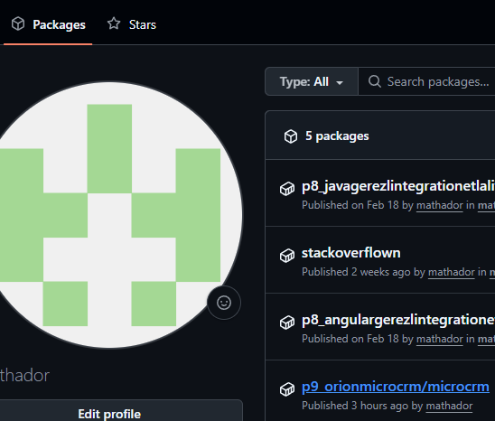
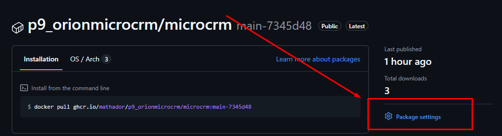
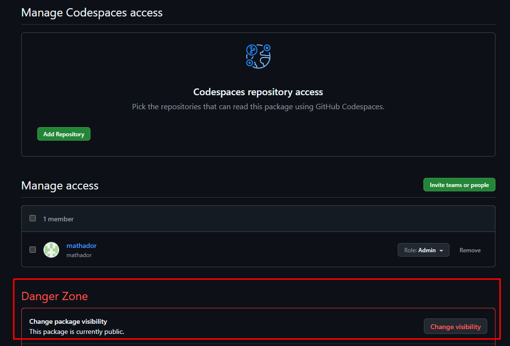

#### Configuration du déploiement CI/CD

##### ⚠️ Sécurité importante

**Ne jamais exposer les secrets dans les logs !**

- ❌ **DANGEREUX** : `echo "${{ secrets.MY_SECRET }}"` → Visible dans les logs
- ✅ **SÉCURISÉ** : `gh auth login --with-token <<< "${{ secrets.MY_SECRET }}"` → Invisible dans les logs

Les logs GitHub Actions sont visibles par tous les contributeurs. Si le repository est public, ils sont visibles par tout internet !

##### Création d'un Personal Access Token (PAT)

Pour permettre au workflow GitHub Actions de publier des images Docker sur GitHub Container Registry, vous devez créer un Personal Access Token avec les permissions appropriées :

1. **Allez sur GitHub** : Paramètres → Developer settings → Personal access tokens → Tokens (classic)
2. **Cliquez** : "Generate new token (classic)"
3. **Nom du token** : `CR_PAT` (ou similaire)
4. **Permissions requises** :
   - ✅ `write:packages` - Permet de publier des packages
   - ✅ `read:packages` - Permet de lire les packages
   - ✅ `delete:packages` - Permet de supprimer des packages (optionnel)
5. **Expiration** : Choisissez une durée appropriée (recommandé : 30 jours ou plus)
6. **Cliquez** : "Generate token"
7. **⚠️ Important** : Copiez immédiatement le token généré (vous ne pourrez plus le voir après)

##### Configuration du secret dans le repository

1. **Allez dans votre repository** : Settings → Secrets and variables → Actions
2. **Cliquez** : "New repository secret"
3. **Nom** : `CR_PAT`
4. **Valeur** : Collez le token généré précédemment
5. **Cliquez** : "Add secret"

Le workflow utilisera automatiquement ce token pour s'authentifier auprès de GitHub Container Registry et publier les images Docker.

##### Rendre l'image Docker publique

Par défaut, les packages GitHub Container Registry sont créés comme **privés**. Pour permettre à tout le monde de télécharger l'image sans authentification :

1. **Allez dans votre repository GitHub**
2. https://github.com/mathador?tab=packages
3. Cliquez sur le nom du package ()
4. Cliquez sur package setting ()
5. Cliquez sur change visibility ()

**Note** : Cette opération n'est possible que si le repository lui-même est public.